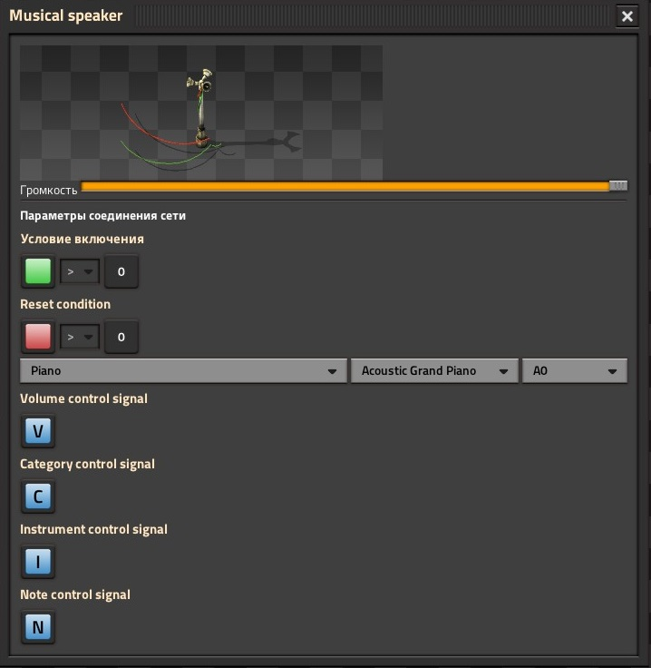

# musical-speaker-fixed

A Factorio mod that provides an enhanced version of enhanced version of the programmable speaker, mostly intended for music production. The mod is based on the original mod [musical-speaker](https://github.com/Xcelled/musical-speaker).

The set of sounds corresponds to the original mod.

Features:
- Sounds stop when the speaker is disabled via circuit network (Vanilla programmable speaker continues playing).
- Control volume, category, instrument and note via circuit network.
- The settings can be set at any time, while the original can only set during the tick when a note starts playing.
- The reset setting allows you to restart sound playback without disable the speaker.
- A fairly convenient system for loading user sounds.
- Some bugs fixed.

# Example usage

An example of work can be seen in this [video](https://youtu.be/hk3BCiMDQDs)

# Installation

**Installing the main mod** 
Go to the latest release and download the attached mod archive `musical-speaker-fixed_n.n.n.zip`. Place the mod archive in your mods directory, eg `%appdata%\factorio\mods`. **The main mod does not contain sound files**.

**Installing user sounds** 
The main mod does not contain any sound files. Sound files are loaded using additional mods. The template for such a mod can be found in the folder [`sound-data-mod-template`](https://github.com/IAmTomaton/musical-speaker-fixed/tree/main/sound-data-mod-template).
You can download the mod archive containing all the sounds of the original `musical-speaker` mod from this [release](https://github.com/IAmTomaton/musical-speaker-fixed/releases/tag/v1.0.3).
Installing a sound mod is similar to installing the main mod.

# Caveats
- For right now, enabled and reset condition comparison is limited to `> 0`.
	- If you want a different condition, use a decider combinator to translate the condition.
- For musical speaker sounds are _not_ pre-loaded by the game.
	- This means that there will be a slight-but-noticeable delay the first time each note is played.
	- If you're in a situation where you need minimal delay (ie recording), play your composition once ahead of time to warm up the sounds.
 
